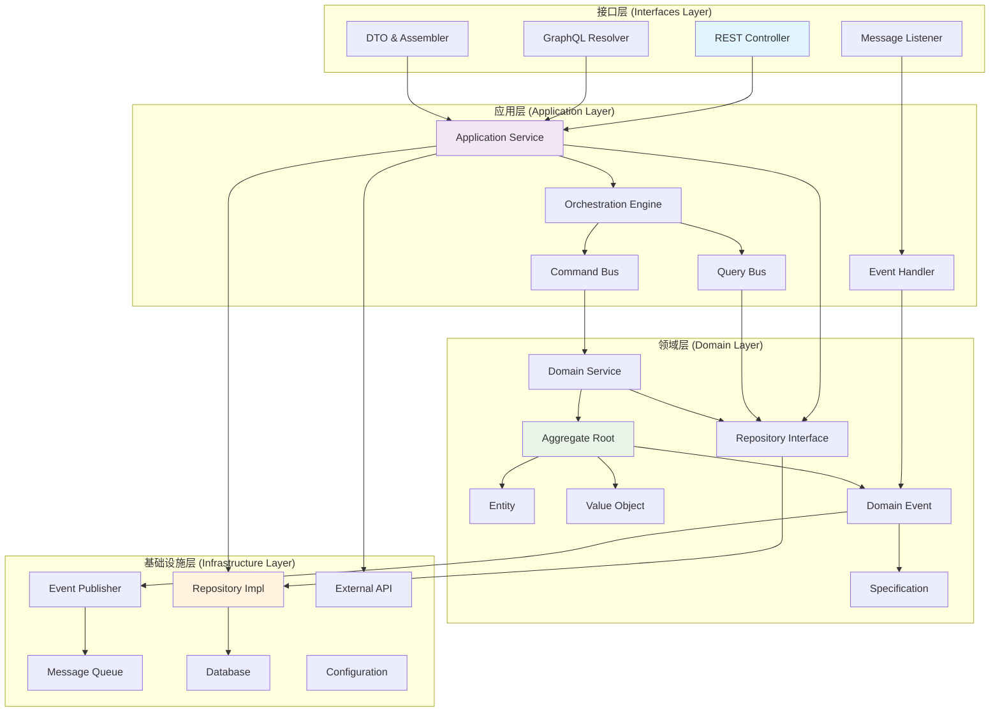
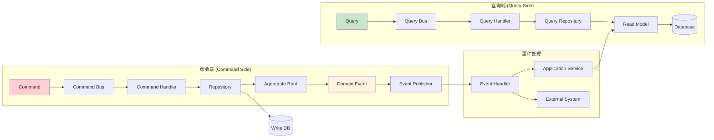
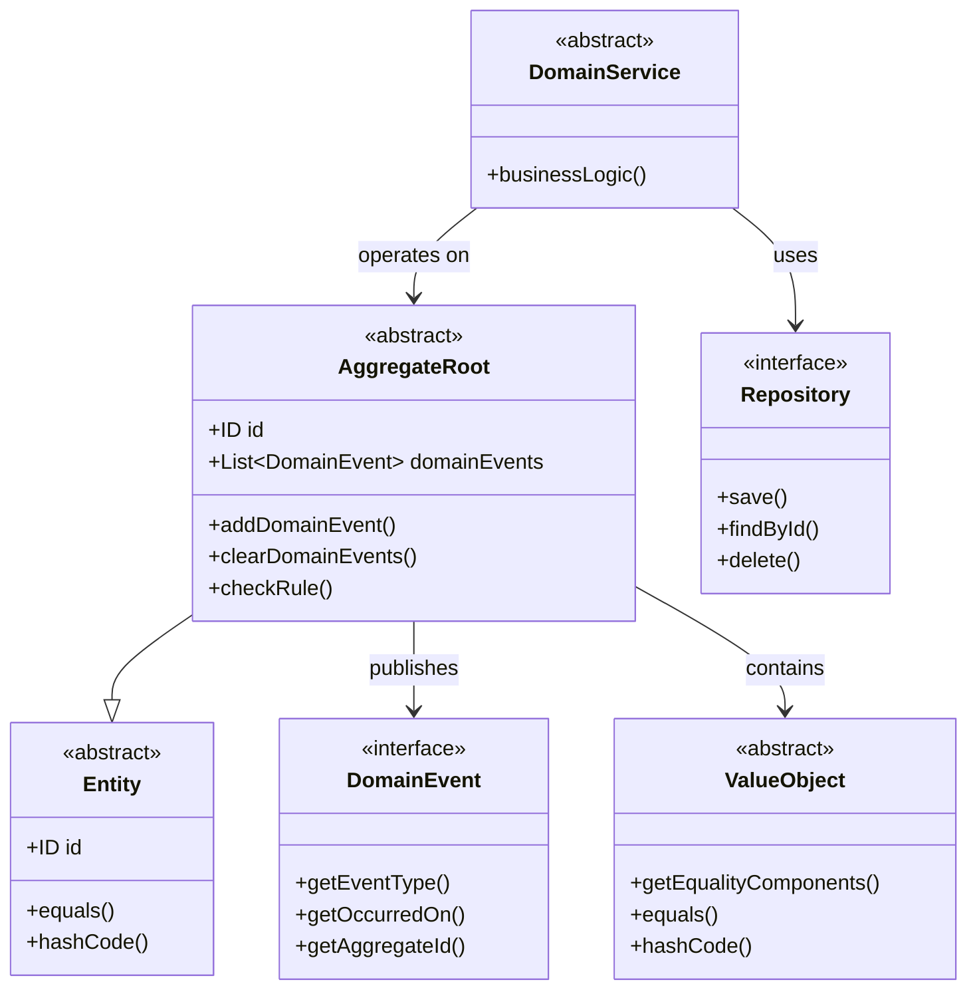
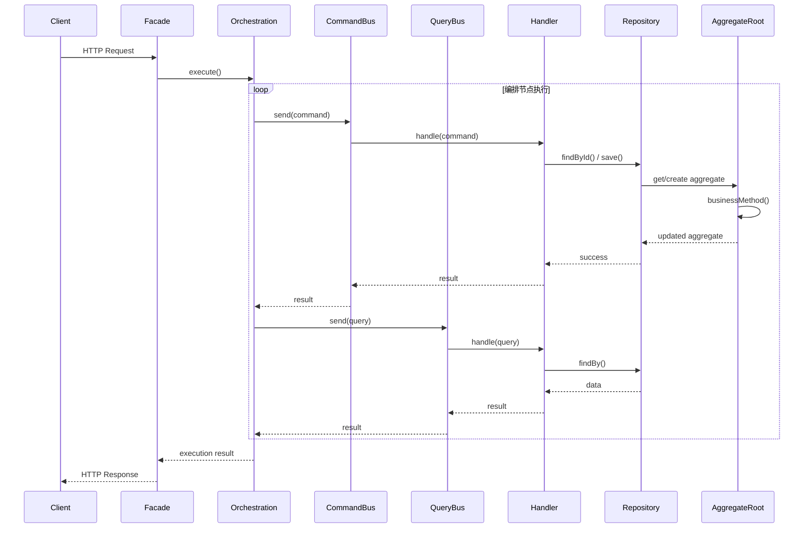
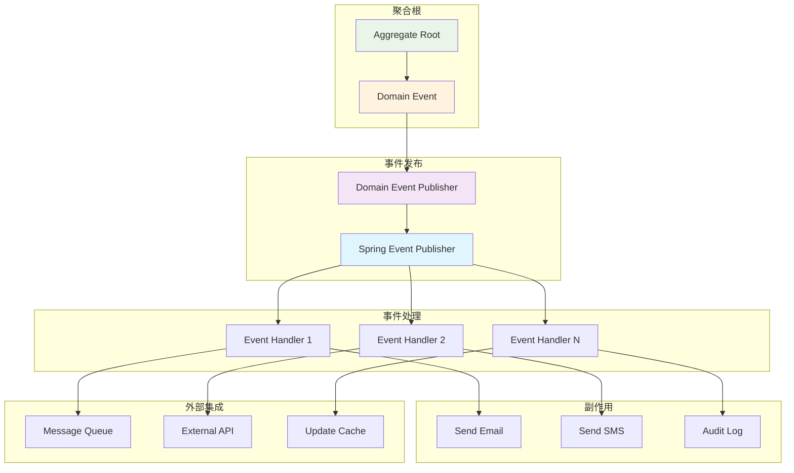
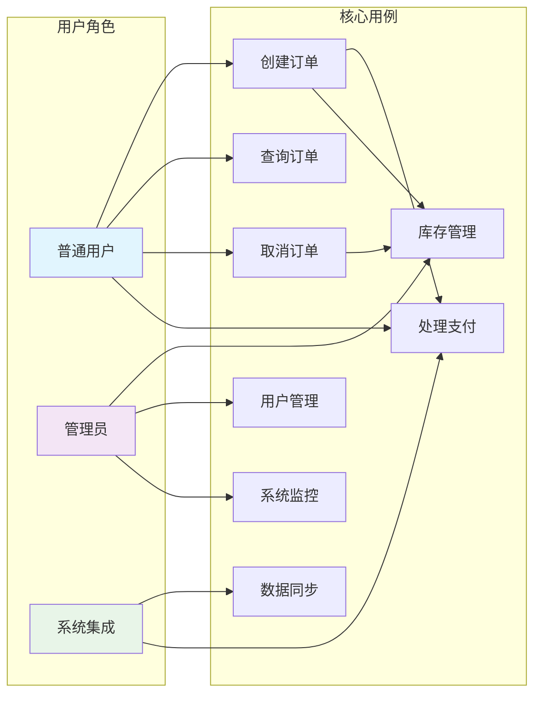
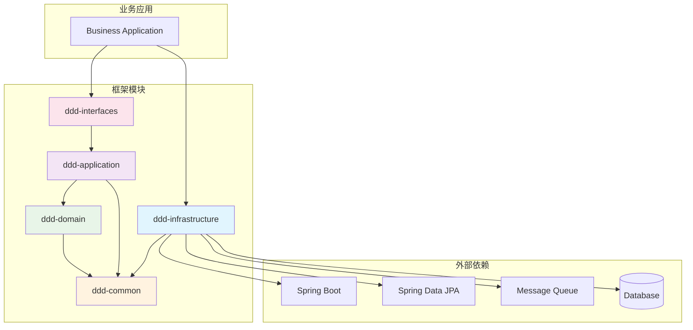
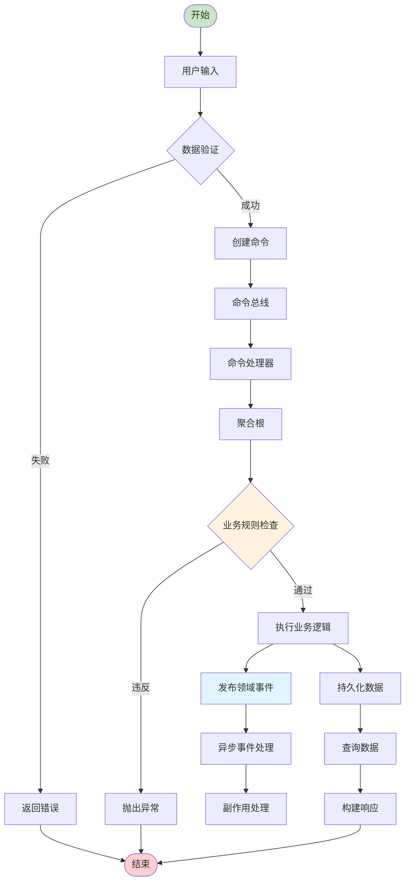

# DDD Framework
一个基于 Spring Boot 的领域驱动设计（Domain-Driven Design）框架，提供完整的 DDD 架构支持和最佳实践实现。
## 🏗️ 框架架构

本框架严格遵循 DDD 分层架构，包含以下核心模块：

```
ddd-framework/
├── ddd-common/          # 通用工具和基础类
├── ddd-interfaces/      # 接口层（用户界面层）
├── ddd-application/     # 应用层
├── ddd-domain/         # 领域层
└── ddd-infrastructure/ # 基础设施层
```

### 分层职责

- **接口层 (Interfaces)**：处理用户请求，数据传输对象（DTO）转换，门面模式实现
- **应用层 (Application)**：业务流程编排，命令查询处理，应用服务协调
- **领域层 (Domain)**：核心业务逻辑，聚合根，实体，值对象，领域服务，业务规则
- **基础设施层 (Infrastructure)**：技术实现，数据持久化，外部服务集成，消息发布

## 📊 架构图表

### 整体架构图



### CQRS 架构图



### 领域模型关系图



### 业务编排时序图



### 事件驱动架构图



### 用例图



### 组件依赖图



### 数据流图



## ✨ 核心功能

### 1. CQRS 支持
- **命令总线 (CommandBus)**：处理写操作，支持同步/异步执行
- **查询总线 (QueryBus)**：处理读操作，优化查询性能
- **处理器自动发现**：基于 Spring 容器的处理器注册和路由

### 2. 领域事件机制
- **事件发布器 (DomainEventPublisher)**：纯领域层实现，不依赖外部框架
- **Spring 集成**：基础设施层提供 Spring 事件发布实现
- **异步处理**：支持事件的异步处理和传播

### 3. 业务编排框架
- **流程编排 (Orchestration)**：支持复杂业务流程的可视化编排
- **节点类型**：Command、Query、Condition、Generic 四种节点类型
- **PlantUML 导出**：自动生成流程图，便于文档化和沟通

### 4. 对象转换体系
- **分层转换器**：每层都有专门的转换器接口和实现
- **类型安全**：基于泛型的类型安全转换
- **Spring 集成**：利用 Spring 容器管理转换器生命周期

### 5. 业务规则验证
- **断言工具 (Assert)**：统一的业务异常处理
- **业务规则接口 (IBusinessRule)**：封装业务不变性和约束条件
- **规则验证**：聚合根内置规则检查机制

### 6. 领域模型基础
- **聚合根 (AbstractAggregateRoot)**：维护业务不变性，管理领域事件
- **实体 (AbstractEntity)**：具有唯一标识的领域对象
- **值对象 (AbstractValueObject)**：不可变的领域概念

## 🚀 快速开始

### 1. 添加依赖

根据项目需要，选择合适的依赖引入方式：

#### 推荐方式：引入所需模块

```xml
<!-- 基础设施层（包含自动配置，必需） -->
<dependency>
    <groupId>io.github.anthem37</groupId>
    <artifactId>ddd-infrastructure</artifactId>
    <version>1.0.1-SNAPSHOT</version>
</dependency>

        <!-- 应用层（CQRS、编排等） -->
<dependency>
<groupId>io.github.anthem37</groupId>
<artifactId>ddd-application</artifactId>
<version>1.0.1-SNAPSHOT</version>
</dependency>

        <!-- 领域层（聚合根、实体等） -->
<dependency>
<groupId>io.github.anthem37</groupId>
<artifactId>ddd-domain</artifactId>
<version>1.0.1-SNAPSHOT</version>
</dependency>

        <!-- 接口层（DTO、门面等） -->
<dependency>
<groupId>io.github.anthem37</groupId>
<artifactId>ddd-interfaces</artifactId>
<version>1.0.1-SNAPSHOT</version>
</dependency>

        <!-- 通用工具（断言、异常等） -->
<dependency>
<groupId>io.github.anthem37</groupId>
<artifactId>ddd-common</artifactId>
<version>1.0.1-SNAPSHOT</version>
</dependency>
```

#### 最小依赖（仅核心功能）

```xml
<!-- 必需：基础设施层（包含自动配置） -->
<dependency>
    <groupId>io.github.anthem37</groupId>
    <artifactId>ddd-infrastructure</artifactId>
    <version>1.0.1-SNAPSHOT</version>
</dependency>

        <!-- 必需：通用工具 -->
<dependency>
<groupId>io.github.anthem37</groupId>
<artifactId>ddd-common</artifactId>
<version>1.0.1-SNAPSHOT</version>
</dependency>

        <!-- 可选：根据需要添加其他模块 -->
```

> **重要说明**：
> - `ddd-infrastructure` 是必需的，包含 Spring Boot 自动配置
> - `ddd-common` 提供基础工具类和异常处理
> - 其他模块可根据实际需要选择性引入
> - 各模块间已配置好依赖关系，Maven 会自动处理传递依赖

### 2. 启用自动配置

在 Spring Boot 应用中，框架会自动配置所有必要的组件：

```java
@SpringBootApplication
public class Application {
    public static void main(String[] args) {
        SpringApplication.run(Application.class, args);
    }
}
```

### 3. 创建聚合根

```java
public class Order extends AbstractAggregateRoot<OrderId> {
    
    private OrderStatus status;
    private List<OrderItem> items;
    
    protected Order(OrderId id) {
        super(id);
        this.status = OrderStatus.PENDING;
        this.items = new ArrayList<>();
    }
    
    public void addItem(OrderItem item) {
        checkRule(new OrderCanAddItemRule(this.status));
        this.items.add(item);
        addDomainEvent(new OrderItemAddedEvent(getId(), item));
        afterBusinessOperation();
    }
    
    @Override
    protected void addDeletedDomainEvent() {
        addDomainEvent(new OrderDeletedEvent(getId()));
    }
}
```

### 4. 实现命令处理器

```java
@Component
public class CreateOrderCommandHandler implements ICommandHandler<CreateOrderCommand, OrderId> {
    
    @Autowired
    private IOrderRepository orderRepository;
    
    @Override
    public OrderId handle(CreateOrderCommand command) {
        Order order = new Order(OrderId.generate());
        // 业务逻辑处理
        orderRepository.save(order);
        return order.getId();
    }
    
    @Override
    public Class<CreateOrderCommand> getSupportedCommandType() {
        return CreateOrderCommand.class;
    }
}
```

### 5. 使用业务编排

```java
@Service
public class OrderProcessOrchestration {
    
    @Autowired
    private ICommandBus commandBus;
    
    @Autowired
    private IQueryBus queryBus;
    
    public void createOrderProcess() {
        Orchestration orchestration = new Orchestration("order-process", "订单处理流程", commandBus, queryBus);
        
        orchestration
            .addCommand("validate", "验证订单", ctx -> new ValidateOrderCommand(ctx.getVariable("orderId", String.class)))
            .addCondition("check-stock", "检查库存", ctx -> checkStock(ctx))
            .addCommand("create-order", "创建订单", ctx -> new CreateOrderCommand())
            .addQuery("get-order", "获取订单", ctx -> new GetOrderQuery())
            .connect("validate", "check-stock")
            .connectWhenTrue("check-stock", "create-order")
            .connect("create-order", "get-order");
            
        // 执行编排
        Orchestration.Result result = orchestration.execute();
        
        // 导出 PlantUML
        String plantUML = orchestration.toPlantUML();
    }
}
```

## 🎯 设计优势

### 1. 严格的分层架构
- **依赖倒置**：内层不依赖外层，通过接口定义契约
- **职责分离**：每层专注自己的职责，降低耦合度
- **可测试性**：纯领域逻辑，易于单元测试

### 2. 类型安全
- **泛型支持**：编译时类型检查，减少运行时错误
- **强类型转换**：转换器提供类型安全的对象转换
- **接口约束**：通过接口定义明确的契约

### 3. Spring 集成
- **自动配置**：零配置启动，开箱即用
- **容器管理**：利用 Spring 容器管理组件生命周期
- **AOP 支持**：支持事务、缓存、安全等横切关注点

### 4. 扩展性
- **插件化架构**：通过接口扩展功能
- **事件驱动**：松耦合的事件机制
- **可配置性**：支持自定义配置和扩展

## 📚 使用案例

### 电商订单系统
```java
// 1. 定义聚合根
public class Order extends AbstractAggregateRoot<OrderId> { ... }

// 2. 实现命令处理
@Component
public class CreateOrderHandler implements ICommandHandler<CreateOrderCommand, OrderId> { ... }

// 3. 定义查询处理
@Component  
public class GetOrderHandler implements IQueryHandler<GetOrderQuery, OrderDTO> { ... }

// 4. 门面层调用
@RestController
public class OrderController extends AbstractBaseFacade {
    
    @PostMapping("/orders")
    public DataResponse<OrderDTO> createOrder(@RequestBody CreateOrderRequest request) {
        CreateOrderCommand command = assembler.toCommand(request);
        OrderId orderId = sendCommand(command);
        
        GetOrderQuery query = new GetOrderQuery(orderId);
        OrderDTO orderDTO = sendQuery(query);
        
        return DataResponse.success(orderDTO);
    }
}
```

### 用户注册流程编排
```java
public class UserRegistrationOrchestration {
    
    public void registerUser(String email, String password) {
        Orchestration orchestration = new Orchestration("user-registration", "用户注册流程", commandBus, queryBus);
        
        orchestration
            .addQuery("check-email", "检查邮箱", ctx -> new CheckEmailExistsQuery(email))
            .addCondition("email-available", "邮箱可用", "check-email", false)
            .addCommand("create-user", "创建用户", ctx -> new CreateUserCommand(email, password))
            .addCommand("send-welcome", "发送欢迎邮件", ctx -> new SendWelcomeEmailCommand(email))
            .connect("check-email", "email-available")
            .connectWhenTrue("email-available", "create-user")
            .connect("create-user", "send-welcome");
            
        Orchestration.Context context = new Orchestration.Context("user-reg-001");
        context.setVariable("email", email);
        context.setVariable("password", password);
        
        Orchestration.Result result = orchestration.execute(context);
        
        if (result.isSuccess()) {
            log.info("用户注册成功，耗时: {}ms", result.getExecutionTimeMillis());
        } else {
            log.error("用户注册失败: {}", result.getErrorMessage());
        }
    }
}
```

## 📖 模块文档

- [ddd-common](ddd-common/README.md) - 通用工具和基础类
- [ddd-interfaces](ddd-interfaces/README.md) - 接口层实现
- [ddd-application](ddd-application/README.md) - 应用层服务
- [ddd-domain](ddd-domain/README.md) - 领域层核心
- [ddd-infrastructure](ddd-infrastructure/README.md) - 基础设施层

## 🤝 贡献指南

1. Fork 项目
2. 创建特性分支 (`git checkout -b feature/AmazingFeature`)
3. 提交更改 (`git commit -m 'Add some AmazingFeature'`)
4. 推送到分支 (`git push origin feature/AmazingFeature`)
5. 打开 Pull Request

## 📄 许可证

本项目采用 MIT 许可证 - 查看 [LICENSE](../LICENSE) 文件了解详情。

## 👥 作者

- **anthem37** - *初始工作* - [GitHub](https://github.com/anthem37)

## 🙏 致谢

感谢所有为这个项目做出贡献的开发者们！